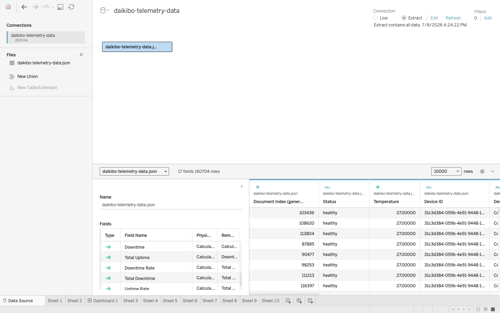
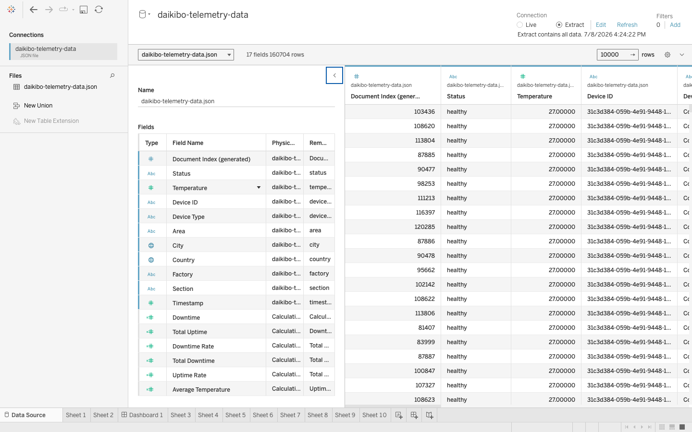
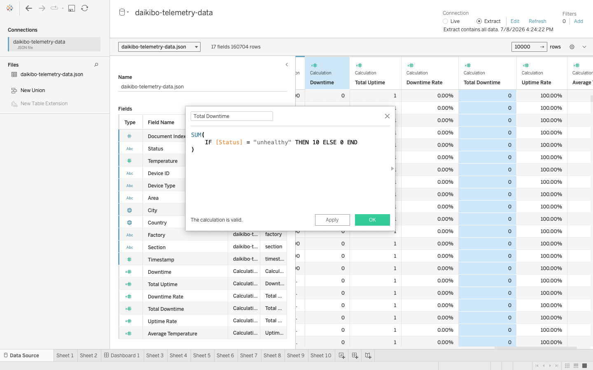
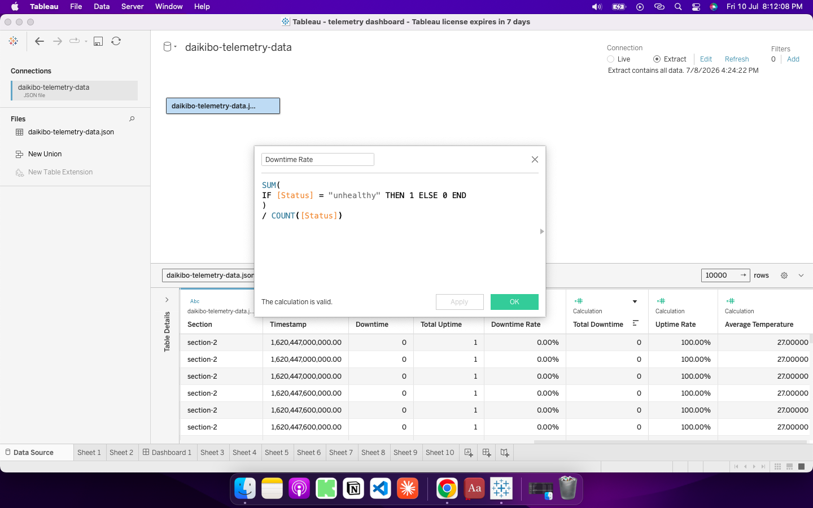
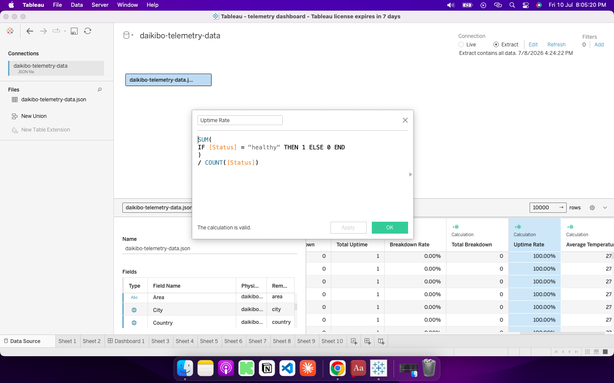
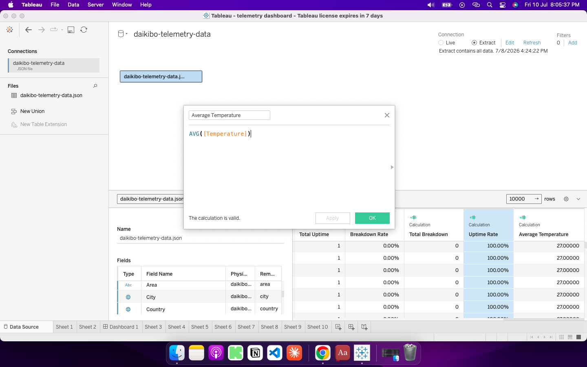
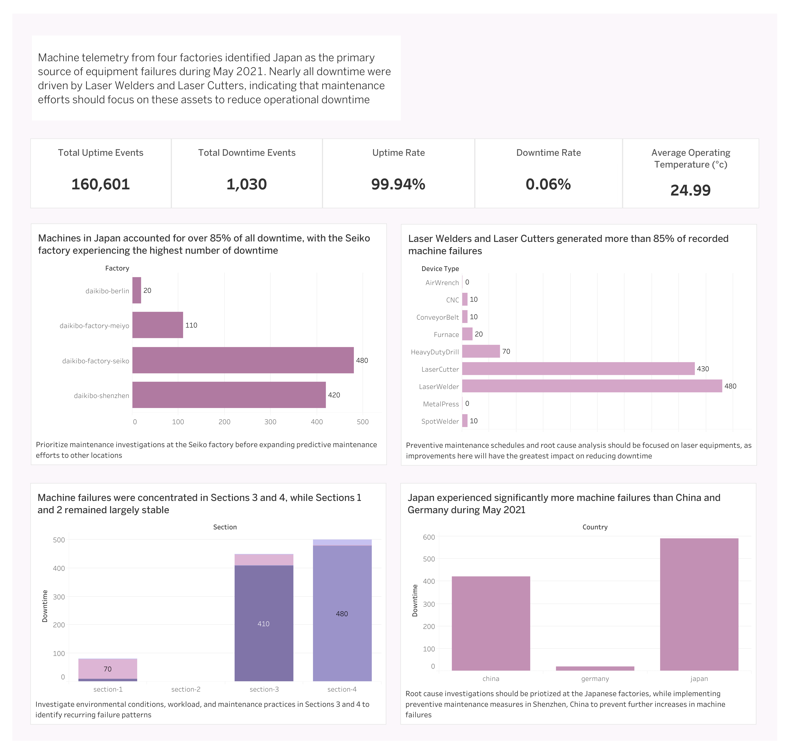

# Machine Downtime Analysis
Cover Image
# Introduction
Every day, hundreds of industrial machines operate across Daikibo's manufacturing facilities, producing thousands of components that keep production running. Behind these operations, each machine continuously generates telemetry data that captures its health and performance. While this stream of data provides a detailed view of factory operations, important questions remain: Which factories experience the most machine failures? Which machines are most prone to breaking down?

Answering these questions is essential for reducing operational downtime, improving equipment reliability, and helping maintenance teams prioritize resources where they are needed most.

As part of the analytics team supporting Daikibo, I stepped into the role of a Data Analyst tasked with analyzing one month of machine telemetry data collected from four global manufacturing facilities. By developing business-focused KPIs and an interactive Tableau dashboard, this analysis uncovers equipment failure patterns, identifies operational risks, and provides data-driven recommendations to support proactive maintenance and more informed operational decision-making.

# Problem Statement
Machine breakdowns can delay production, increase repair costs, and reduce manufacturing efficiency. Although Daikibo collects telemetry data from its manufacturing facilities every day, the company lacked a clear understanding of where equipment failures occurred most frequently and which machine types contributed most to downtime.

Without these insights, it's difficult to know where problems are happening or which machines need attention first. As a result, machines are often repaired only after they break down, leading to production delays and higher maintenance costs. By analyzing machine telemetry data, the company can identify failure patterns, address issues earlier, and keep its factories running more efficiently.

For this analysis, we’re going to focus on the questions below to get the information we need for our client -

Here are the key questions we need to answer for our client:

1. In which location did machines break the most?
2. What are the machines that broke most often in that location?

# Objective
The goal of this project is to analyze one month of machine telemetry data collected from Daikibo's four manufacturing facilities. Using Tableau, I explored the data to identify where machine breakdowns happened most often, which machines failed the most, and what patterns could help the company reduce downtime and improve maintenance planning. The goal is to turn raw machine data into clear insights that support better business decisions.

# Data Summary
This analysis draws on one month of machine telemetry data collected from Daikibo's four global manufacturing facilities in Japan, Germany, and China. The dataset, provided as part of the Deloitte Data Analytics Virtual Experience on Forage, contains telemetry records from nine machine types, with each machine reporting its operational status every 10 minutes. Before analysis, the data required minor preparation, which includes creating calculated fields to classify machine status into uptime and downtime events for KPI development and visualization in Tableau.
Check data here https://www.theforage.com/virtual-experience/io9DzWKe3PTsiS6GG/deloitte-australia/data-analytics-s5zy/data-analysis

# Methodology
## Data Import

- Imported the JSON telemetry dataset into Tableau
- Verified all schema levels during import to ensure the complete dataset was loaded

## Data Exploration

Before creating visualizations, I explored the dataset to understand its structure and identify the fields required for the analysis.

Key fields included:

- Factory
- Country
- Device Type
- Section
- Status
- Temperature
- Timestamp

## Data Enrichment

The original dataset did not contain downtime, uptime, business KPIs, so I created calculated fields to support the analysis.

#### Total Downtime

#### Downtime Rate

#### Total Uptime

#### Uptime Rate

#### Average Temperature

# Analysis and Visualization

I created an interactive Tableau dashboard to make the data easy to understand. The dashboard includes KPI cards that show the overall performance of the machines, such as total uptime, total downtime, uptime rate, downtime rate, and average temperature. I also used bar charts to compare downtime by factory, machine type, section, and country. To make the dashboard more understandable, I set the Factory chart as a filter, so selecting a factory updates other charts to show only data for that location. 

I used clear chart titles, data labels, and business insight annotations were included so that both technical and non-technical stakeholders can quickly understand the findings and make decisions

To interact with the dashboard, click [here](https://public.tableau.com/views/telemetrydashboard_17835243308940/Dashboard1?:language=en-GB&:sid=&:redirect=auth&:display_count=n&:origin=viz_share_link)

# Findings

Based on your dashboard, these are the **main findings** you should include in your case study. I've written them in simple, professional English.

---

# Key Findings

### 1. Japan recorded the highest number of machine breakdowns

The two factories in Japan accounted for over 85% of all recorded downtime during May 2021, among them is Daikibo and Seiko Factory which experienced the highest number of breakdowns, making it a high risk location

### 2. Laser equipment caused most machine failures

Laser Welders and Laser Cutters were responsible for more than 85% of all downtime events, this suggests that these machine types require closer monitoring and more frequent maintenance than other equipment

### 3. Machine failures were concentrated in specific sections

Most breakdowns occurred in Sections 3 and 4, while Sections 1 and 2 experienced little to no downtime, this indicates that operational conditions or maintenance practices may differ between sections

### 4. Germany and China experienced very few breakdowns

Compared to Japan, the factories in Germany and China recorded significantly fewer machine failures, their low downtime suggests that current maintenance practices and operating conditions at these locations may be more effective

### 5. Overall machine reliability remained high

Despite the concentration of failures in a few locations and machine types, the overall uptime rate was 99.94%, while the downtime rate was only 0.06%. This shows that most machines operated normally throughout the month

### 6. Machine temperature did not explain equipment failures

The average operating temperature remained around 24.99°C across the dataset, with very little difference between machines. Because the temperature values were almost identical, no meaningful relationship between temperature and machine breakdowns could be identified
